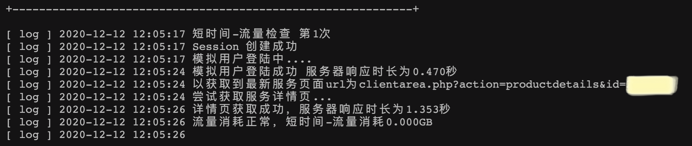

# vpnmonitor

```author :jijue```

## 项目介绍

该工具用于检测vpn流量使用情况，当流量在短时间内使用情况超过某个阈值的时候会自动发邮件告警

该工具是本人基于目前正在使用的hkjss vpn平台的个例写的，所以不具备普适性，受众较小，有兴趣可以自行读一遍代码

工具可以定期监控流量已使用情况，并例行发邮件通知
  
(原谅我令人发笑的打码水平)

还有日志记录

## 配置项

* vpnmonitor通过deamon实现守护进程，所以需要将vpnmonitor.service文件复制到/etc/systemd/system/目录下，并用```systemctl start vpnmonitor```命令启动vpnmonitor，如果要停用工具，请用```systemctl stop vpnmonitor```

* 邮件发送，通过修改send_mail函数中收件邮箱、发件邮箱账号、发件邮箱授权码三个变量的值即可使用

* vpn账号，通过修改dict_hkjss字典的auth键的值改为自己的账号密码即可

* 三方模块，vpnmonitor只用了一个bs4用于html解析，其余的都是标准库，就不单独写require文件了

* vpnmonitor运行于python2.7